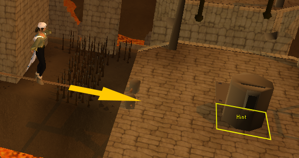

# No Hint-Arrow

Completely remove the flashing yellow hint arrow, or let it only show for a set length of seconds. **note: It can remove the flashing arrow from Jagex's official uses (such as tutorials or agility arena), but some RuneLite plugins will re-add their flashing arrow.**

Replaces the hint with a substitute: a tile marker square and a (non-flashing) arrow pointing towards the direction.

# Options

<table class="optionsTable">
  <tr>
    <th>Setting</th>
    <th>Default Value</th>
    <th>Description</th>
  </tr>
  <tr>
    <td>Clear Delay (seconds)</td>
    <td><code>0</code></td>
    <td>How many seconds before the hint arrow is cleared automatically</td>
  </tr>
  <tr>
    <th colspan="3">Substitute Marker Settings</th>
  </tr>
  <tr>
    <td>Use a substitute tile marker</td>
    <td><code>true</code></td>
    <td>Show a substitute tile marker for the removed hint arrow</td>
  </tr>
  <tr>
    <td>Duration (seconds)</td>
    <td><code>60</code> (1 minute)</td>
    <td>How many seconds before the substitute tile marker is cleared</td>
  </tr>
  <tr>
    <td>Color</td>
    <td><code>#FFFF00</code> (Yellow)</td>
    <td>Choose the color for the substitute tile marker</td>
  </tr>
  <tr>
    <td>Show Label</td>
    <td><code>true</code></td>
    <td>Show a text label ("Hint") on the substitute tile marker</td>
  </tr>
  <tr>
    <th colspan="3">Substitute Arrow Settings</th>
  </tr>
  <tr>
    <td>Use a substitute arrow</td>
    <td><code>true</code></td>
    <td>Show a substitute arrow for the removed hint arrow</td>
  </tr>
  <tr>
    <td>Duration (seconds)</td>
    <td><code>60</code> (1 minute)</td>
    <td>How many seconds before the substitute arrow is cleared</td>
  </tr>
  <tr>
    <td>Color</td>
    <td><code>#FFC800</code> (Orange)</td>
    <td>Choose the color for the substitute arrow</td>
  </tr>
  <tr>
    <td>Clear radius</td>
    <td><code>3</code> (approximately 1 tile)</td>
    <td>Radius of clear space around player before the arrow starts</td>
  </tr>
  <tr>
    <th colspan="3">Debug Options</th>
  </tr>
  <tr>
    <td>Manually add Hint-Arrows</td>
    <td><code>false</code></td>
    <td>Enable shift click to manually set hint arrows</td>
  </tr>
  <tr>
    <td>Debug Messages</td>
    <td><code>None</code></td>
    <td>Show debug messages in chatbox</td>
  </tr>
  <tr>
    <td>Debug Message Color</td>
    <td><code>#7F007F</code> (same purple as incoming trade requests)</td>
    <td>Choose the color for debug text</td>
  </tr>
</table>
